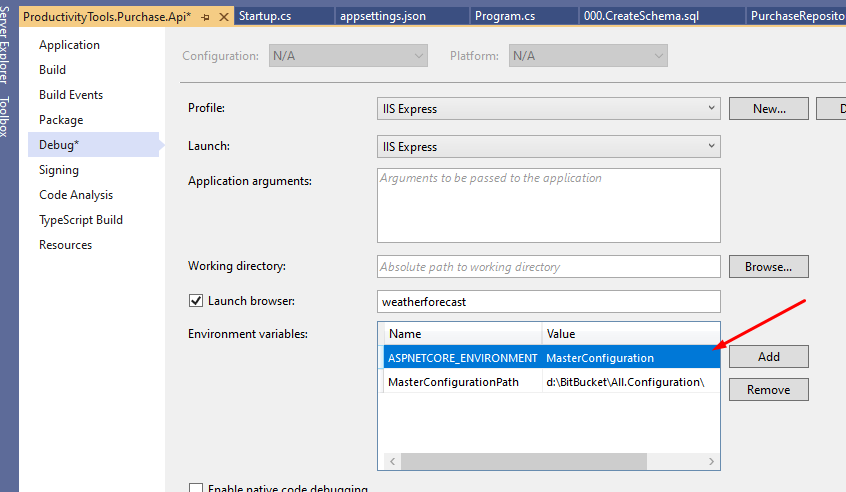

<!--Category:C#--> 
 <p align="right">
        <a href="https://www.https://www.nuget.org/packages/ProductivityTools.MasterConfiguration/"></a>
        <a href="http://productivitytools.tech/masterconfiguration/"><a> 
        <a href="https://github.com/pwujczyk/ProductivityTools.MasterConfiguration"></a>
</p>
<p align="center">
    <a href="http://productivitytools.tech/">
        
    </a>
</p>


# ProductivityTools.MasterConfiguration

- shouldn't be commited to the public repository
- should be placed in private repository
- should be easy to change and maintain, locally and on production server

Idea of master configuration:
- store all configuration in the separate git repository 


When I am writing code very often I use configuration which shouldn't be shared in the public git repository. On the other hand it is not convenient for me to store configuration in the environment variables. 

Idea MasterConfiguration is to store configuration of all applications in one place which could be pushed to private git repository.

In detail:
- you setup two environment variables for all application, one informing that you use MasterConfiguration, second that points to directory with configuration files
- application during startup takes configuration from that place and read critical information from there
- this place can be second git repository, which is private 
- it is not most secured way of storing configuration, but it is most convienient way of storing configuration

# Master Configuration usage

## Environment setup 
- Environment variable **ASPNETCORE_ENVIRONMENT** needs to be set to `MasterConfiguration`
- Environment variable **MasterConfigurationPath** needs to point to the directory with configuration (for my case is D:\BitBucket\All.Configuration\)
- In the directory mentioned above json file with configuration needs to be placed. Json file should be called as the main project file for example **ProductivityTools.Purchase.Api.json**. Name can be changed, see below.

## Application setup

### WebApi

To the ``IConfigurationBuilder`` add ``AddMasterConfiguration`` extension method

```c#
public static IHostBuilder CreateHostBuilder(string[] args) =>
    Host.CreateDefaultBuilder(args)
         .ConfigureAppConfiguration((hostingContext, config) =>
         {
             config.AddMasterConfiguration();
         })
        .ConfigureWebHostDefaults(webBuilder =>
        {
            webBuilder.UseStartup<Startup>();
        });

```

### Console applications

```c#
IConfigurationRoot configuration = new ConfigurationBuilder()
.AddMasterConfiguration()
.Build();

var r = configuration["Region"];
return r;
```

### Legacy applications 

Install nuget: **Microsoft.Extensions.Configuration.Json** 

```c#
IConfigurationRoot configuration = new ConfigurationBuilder()
.AddMasterConfiguration()
.Build();

var r = configuration["Region"];
return r;
```


### Development scenario 
If you want to use MasterConfiguration file during development you should setup two environment variables:
- ASPNETCORE_ENVIRONMENT - MasterConfiguration (instead of Development)
- MasterConfigurationPath - Path to MasterConfiguration file

Or you could use **Force** flag described below

 

## Customization

### Force flag 
If we don't want to setup environment variable (for example we would like to use it only for some simple validation) we can pass true to the force flag of the AddMasterConfiguration method. Then MasterConfiguration file will be added always to the configuration providers. (It doesn't mean that it will use always data from master configuration file. If you add another provider after AddMasterConfiguration last file will override master configuration file)

```c#
public static IHostBuilder CreateHostBuilder(string[] args) =>
    Host.CreateDefaultBuilder(args)
         .ConfigureAppConfiguration((hostingContext, config) =>
         {
             config.AddMasterConfiguration(force: true);
         })
        .ConfigureWebHostDefaults(webBuilder =>
        {
            webBuilder.UseStartup<Startup>();
        });
```
